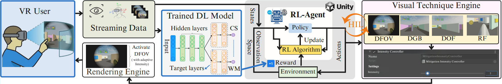
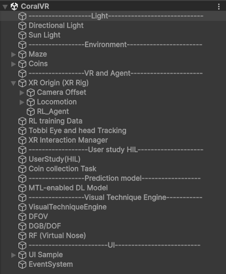

# CoralVR: Cognitive State Optimization via Multi-Objective Reinforcement Learning and Adaptive Visual Techniques in VR

**CoralVR** is a multi-objective reinforcement learning (RL) framework that jointly optimizes users' cognitive states by reducing cybersickness, balancing cognitive load, and improving working memory during VR immersion.

The framework incorporates an MTL-enabled DL prediction model, a PPO-based RL agent, an adaptive visual technique engine (DFOV, DGB, DOF, RF), and a human-in-the-loop (HIL) personalization process.

---

<p align="center">
  
</p>

---

## Overview

CoralVR operates as a closed-loop system within a VR environment:

1. **MTL-enabled DL Model** -- Predicts user cognitive states (cybersickness, cognitive physical load, cognitive mental load, working memory) in real time from streaming eye- and head-tracking data.
2. **Multi-Objective RL Agent** -- Uses predicted states to shape a multi-objective reward. The PPO-trained agent selects visual techniques and adaptively adjusts their intensity.
3. **Visual Technique Engine** -- Applies the selected technique at the specified intensity. Supports four techniques: Dynamic Field of View (DFOV), Dynamic Gaussian Blur (DGB), Depth of Field (DOF), and Rest Frame / Virtual Nose (RF).
4. **HIL Personalization** -- Fine-tunes the RL policy using in-session comfort ratings and post-session feedback to adapt to individual tolerance profiles.

---

## Requirements

| Component | Version | Notes |
|-----------|---------|-------|
| **Unity** | 6 LTS or newer | URP and ML-Agents support |
| **Unity ML-Agents Toolkit** | 4.0.0 | PPO training and ONNX model export |
| **Python** | 3.9 - 3.11 | Training backend |
| **VR SDK** |  OpenXR | XR runtime |
| **Tobii XR SDK**  | 4.x | Eye, head tracking |

---

## Repository Structure

```
CoralVR/
|
+-- Assets/
|   +-- Scenes/
|   |   +-- CoralVR.unity
|   +-- Scripts/
|   |   +-- RL_Agent/
|   |   |   +-- CoralVRAgent.cs            # PPO RL agent (inference + training)
|   |   |   +-- CoralVRControl.cs           # Manual keyboard control for testing
|   |   |   +-- CoralVRFeeder.cs            # Domain-randomized feature feeder
|   |   |   +-- CoralVRLiveSensorsXR.cs     # Live XR sensor bridge (eye + head)
|   |   |   +-- VisualTechniqueEngine.cs    # Applies DFOV / DGB / DOF / RF
|   |   +-- UserStudy/
|   |   |   +-- SpeechRecogniser.cs         # Voice feedback input
|   |   |   +-- HilCsvLogger.cs             # HIL session data logger
|   |   |   +-- ParticipantSessionCounter.cs
|   |   |   +-- ParticipantIdSettings.cs
|   |   +-- MTLPredictionModel.cs           # MTL-enabled DL prediction
|   |   +-- GetInferenceFromDeepLearningModel.cs  # ONNX runtime inference
|   |   +-- CustomTunnelingVignetteController.cs  # DFOV implementation
|   |   +-- DynamicGaussianBlur/
|   |   |   +-- BlurDriver.cs              # DGB/DOF implementation
|   |   +-- SingleNose/
|   |   |   +-- SingleNose.cs              # RF (Virtual Nose) implementation
|   |   +-- Tobbi_Api/                     # Tobii eye and head tracking API
|   +-- RL_Models/
|   |   +-- CoralVR.onnx                   # Trained PPO model
|   +-- StreamingAssets/Model/
|   |   +-- MTL-Based_DL_Model.onnx        # MTL-enabled DL prediction model
|   +-- Data/                              # Session data
|   +-- Data_HIL/                          # HIL personalization data
|
+-- Training/
|   +-- config_coralvr.yaml
|
+-- Image/
|   +-- hierarchy.png
|   +-- Framework.png
|
+-- README.md
```

---

## Scene Composition

<p align="center">
  
</p>

| GameObject | Description |
|------------|-------------|
| **MTL-enabled DL Model** | Transformer model predicting cybersickness, cognitive load, and working memory (ONNX). |
| **XR Origin (XR Rig)** | Player rig for VR locomotion and tracking. |
| **RL_Agent** | RL inference component using the trained PPO model (`CoralVR.onnx`). |
| **RL training Data** | Training data and configuration. |
| **Tobii Eye and head Tracking** | Eye-tracking module for gaze and pupil data. |
| **UserStudy (HIL)** | Collects comfort ratings and verbal feedback for HIL personalization. |
| **Coin collection Task** | Task for cognitive load measurement. |
| **VisualTechniqueEngine** | Central hub that applies the selected visual technique. |
| **DFOV** | Dynamic Field of View restriction (tunneling vignette). |
| **DGB/DOF** | Dynamic Gaussian Blur and Depth of Field blur. |
| **RF (Virtual Nose)** | Rest frame visual anchor. |

---

## RL Agent Training

### PPO Configuration (`Training/config_coralvr.yaml`)

```yaml
behaviors:
  CoralVR:
    trainer_type: ppo
    hyperparameters:
      batch_size: 512
      buffer_size: 10240
      learning_rate: 1.0e-4
      beta: 1.0e-2
      epsilon: 0.2
      lambd: 0.95
      num_epoch: 5
    network_settings:
      normalize: true
      hidden_units: 256
      num_layers: 2
    reward_signals:
      extrinsic:
        strength: 1.0
        gamma: 0.995
    max_steps: 5.0e5
    time_horizon: 128
    summary_freq: 20000
```

Training uses domain-randomized VR maze environments with variations in layout, motion dynamics, and visual flow.

**Training command:**

```bash
mlagents-learn Training/config_coralvr.yaml --run-id=CoralVR_train --force
```

The exported `.onnx` model (`CoralVR.onnx`) is loaded in Unity for runtime inference.

---

## Multi-Objective Reward

The RL agent optimizes a multi-objective reward across four user cognitive states:

| Weight | State | Goal |
|--------|-------|------|
| 0.50 | Cybersickness (CS) | Reduce |
| 0.15 | Cognitive Physical Load (CPL) | Balance |
| 0.15 | Cognitive Mental Load (CML) | Balance |
| 0.10 | Working Memory (WM) | Improve |

Penalty terms regulate excessive intensity, abrupt changes, and frequent technique switching to encourage smooth transitions.

---

## References

- [Unity ML-Agents Toolkit (v4.0.0)](https://github.com/Unity-Technologies/ml-agents)
- [Tobii XR SDK](https://vr.tobii.com/sdk/)

---
