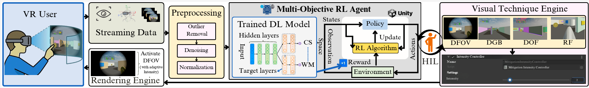
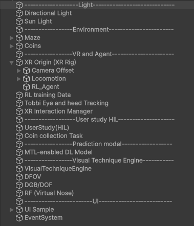

# AURORA: A Multi-Objective Reinforcement Learning Framework for Adaptive Cognitive State Optimization in Virtual Reality

**AURORA** is a multi-objective reinforcement learning (RL) framework that jointly optimizes users' cognitive states by reducing cybersickness, balancing cognitive load, and improving working memory during VR immersion. The framework incorporates an MTL-enabled DL prediction model, a PPO-based RL agent, an adaptive visual technique engine, and a human-in-the-loop (HIL) personalization process.

---

<p align="center">
  
</p>

---

## Overview

AURORA operates as a closed-loop system within a VR environment:

1. **Multi-Objective RL Agent Development** - An MTL-enabled DL model predicts user cognitive states (cybersickness, cognitive physical load, cognitive mental load, working memory) in real time from streaming eye- and head-tracking data. These predictions shape a multi-objective reward, and the PPO-trained agent selects visual techniques and adaptively adjusts their intensity.
2. **Visual Technique Engine** - Applies the selected technique at the specified intensity. Supports four techniques: Dynamic Field of View (DFOV), Dynamic Gaussian Blur (DGB), Depth of Field (DOF), and Rest Frame / Virtual Nose (RF).
3. **HIL Personalization** - Fine-tunes the RL policy using in-session comfort ratings and post-session feedback to adapt to individual tolerance profiles.

---

## Requirements

| Component | Version | Notes |
|-----------|---------|-------|
| **Unity** | 6000.0.57f1 (Unity 6) | URP and ML-Agents support |
| **Unity ML-Agents Toolkit** | 4.0.0 | PPO training and ONNX model export |
| **Python** | 3.10.x | Training backend |
| **ONNX Runtime** | Microsoft.ML.OnnxRuntime | MTL model inference |
| **VR SDK** | OpenXR 1.14.3 | XR runtime |
| **Tobii XR SDK** | 3.0.1 | Eye, head tracking (bundled in `TobiiXRSDK_3.0.1.179/`) |
| **HMD** | HTC Vive Pro Eye | Tested headset with integrated eye tracking |

---

## Repository Structure

```
AURORA/
|
+-- Assets/
|   +-- Scenes/
|   |   +-- Aurora.unity
|   +-- scripts/
|   |   +-- RL_Agent/
|   |   |   +-- AuroraAgent.cs             # PPO RL agent (inference + training)
|   |   |   +-- AuroraControl.cs            # Manual keyboard control for testing
|   |   |   +-- AuroraFeeder.cs             # Domain-randomized feature feeder
|   |   |   +-- AuroraLiveSensorsXR.cs      # Live XR sensor bridge (eye + head)
|   |   |   +-- VisualTechniqueEngine.cs    # Applies DFOV / DGB / DOF / RF
|   |   +-- UserStudy/
|   |   |   +-- SpeechRecogniser.cs         # Voice feedback input
|   |   |   +-- HilCsvLogger.cs             # HIL session data logger
|   |   |   +-- ParticipantSessionCounter.cs
|   |   |   +-- ParticipantIdSettings.cs
|   |   +-- PredictDlModelResult.cs         # MTL-enabled DL prediction (feeds the RL reward)
|   |   +-- GetInferenceFromDeepLearningModel.cs  # ONNX Runtime inference
|   |   +-- CustomTunnelingVignetteController.cs  # DFOV implementation
|   |   +-- DynamicGaussianBlur/
|   |   |   +-- BlurDriver.cs              # DGB/DOF implementation
|   |   +-- SingleNose/
|   |   |   +-- SingleNose.cs              # RF (Virtual Nose) implementation
|   |   +-- Tobbi_Api/                     # Tobii eye and head tracking API
|   +-- RL_Models/
|   |   +-- Aurora.onnx                    # Trained PPO model
|   +-- StreamingAssets/Model/
|   |   +-- MTL-Based_DL_Model.onnx        # MTL-enabled DL prediction model
|   |   +-- mtl_scaler_params.json         # Input feature scaler parameters
|   +-- Data/                              # Session data (created at runtime)
|   +-- Data_HIL/                          # HIL personalization data (created at runtime)
|
+-- Training/
|   +-- config_aurora.yaml
|   +-- config_aurora_hil.yaml
|
+-- Image/
|   +-- hierarchy.png
|   +-- Framework.png
|
+-- README.md
```

---

## Scene Composition

<p align="center">
  
</p>

| GameObject | Description |
|------------|-------------|
| **MTL-enabled DL Model** | Transformer model predicting cybersickness, cognitive load, and working memory (ONNX). |
| **XR Origin (XR Rig)** | Player rig for VR locomotion and tracking. |
| **RL_Agent** | RL inference component using the trained PPO model (`Aurora.onnx`). |
| **RL training Data** | Training data and configuration. |
| **Tobii Eye and head Tracking** | Eye-tracking module for gaze and pupil data. |
| **UserStudy (HIL)** | Collects comfort ratings and verbal feedback for HIL personalization. |
| **Coin collection Task** | Task for cognitive load measurement. |
| **VisualTechniqueEngine** | Central hub that applies the selected visual technique. |
| **DFOV** | Dynamic Field of View restriction (tunneling vignette). |
| **DGB/DOF** | Dynamic Gaussian Blur and Depth of Field blur. |
| **RF (Virtual Nose)** | Rest frame visual anchor. |

---

## RL Agent Training

### PPO Configuration (`Training/config_aurora.yaml`)

```yaml
behaviors:
  Aurora:
    trainer_type: ppo
    hyperparameters:
      batch_size: 512
      buffer_size: 10240
      learning_rate: 1.0e-4
      beta: 1.0e-2
      epsilon: 0.2
      lambd: 0.95
      num_epoch: 5
    network_settings:
      normalize: true
      hidden_units: 256
      num_layers: 2
    reward_signals:
      extrinsic:
        strength: 1.0
        gamma: 0.995
    max_steps: 5.0e5
    time_horizon: 128
    summary_freq: 20000
```

### Training Environment Setup

AURORA training follows the standard Unity ML-Agents workflow using domain-randomized VR maze environments with variations in layout, motion dynamics, and visual flow. The MTL-enabled DL model used for reward shaping is trained on the open-source VRWalking dataset.

Refer to: [Unity ML-Agents Toolkit -- Training Environments](https://github.com/Unity-Technologies/ml-agents/blob/develop/docs/Learning-Environment-Create-New.md)

**Training command:**

```bash
mlagents-learn Training/config_aurora.yaml --run-id=Aurora_train --force
```

**HIL fine-tuning command** (initialized from `Aurora_train`):

```bash
mlagents-learn Training/config_aurora_hil.yaml --run-id=Aurora_HIL
```

The exported `.onnx` model (`Aurora.onnx`) is loaded in Unity for runtime inference.

---

## Multi-Objective Reward

The RL agent optimizes a multi-objective reward across four user cognitive states:

| Weight | State |
|--------|-------|
| 0.45 | Cybersickness (CS) |
| 0.20 | Cognitive Physical Load (CPL) |
| 0.20 | Cognitive Mental Load (CML) |
| 0.15 | Working Memory (WM) |

Penalty terms regulate excessive intensity, abrupt changes, and frequent technique switching to encourage smooth transitions.

---

## References

- [Unity ML-Agents Toolkit (v4.0.0)](https://github.com/Unity-Technologies/ml-agents)
- [Tobii XR SDK](https://vr.tobii.com/sdk/)

---
